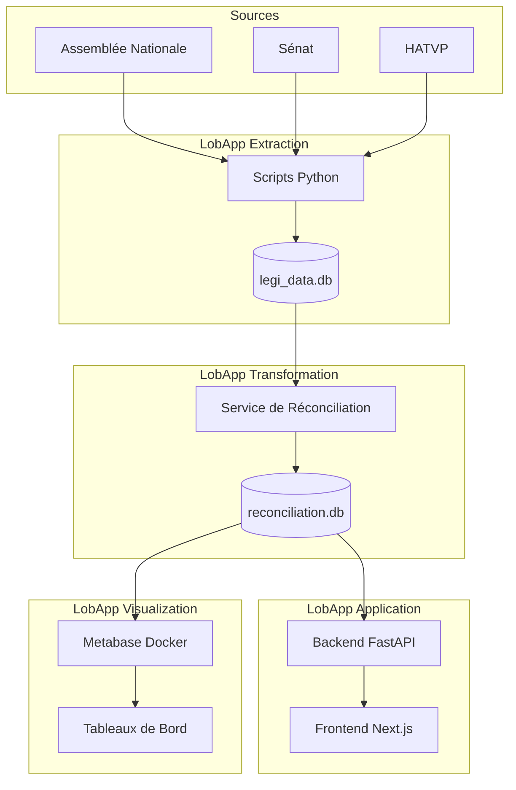

# LobApp - Documentation du Projet

Bienvenue dans la documentation technique du projet **LobApp**. Ce projet vise à agréger, réconcilier et analyser les données législatives françaises (Assemblée Nationale, Sénat) et les données de transparence (HATVP) pour mettre en lumière l'influence des représentants d'intérêts.

## Vue d'ensemble de l'architecture

Le projet est divisé en trois briques principales :

1.  **[LobApp Extraction](components/extraction.md)** : Collecte et ingestion des données brutes.
1.  **[LobApp Extraction](components/extraction.md)** : Collecte et ingestion des données brutes.
2.  **[LobApp Transformation](components/transformation.md)** : Réconciliation des données parlementaires et structuration relationnelle.
3.  **[LobApp Backend](components/backend.md)** : API REST (FastAPI) exposant les données.
4.  **[LobApp Frontend](components/frontend.md)** : Interface utilisateur (Next.js).
5.  **[LobApp Visualization](components/visualization.md)** : Interface d'exploration BI (Metabase).

## Ressources Techniques

- **[Schéma de Base de Données](schematics/database_schema.md)** : Règles de conception et structure des données.

## Dépôts liés

- `lobapp-extraction`
- `lobapp-transformation`
- `lobapp-back`
- `lobapp-front`
- `lobapp-metabase`
